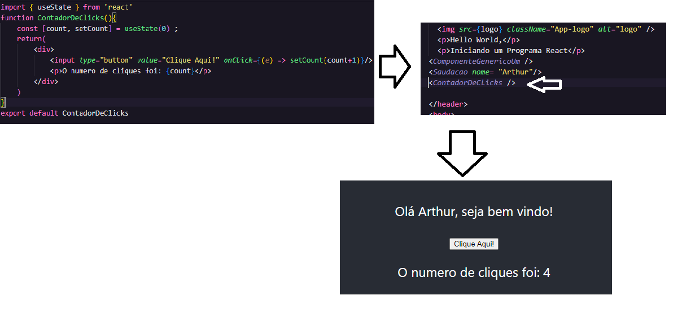
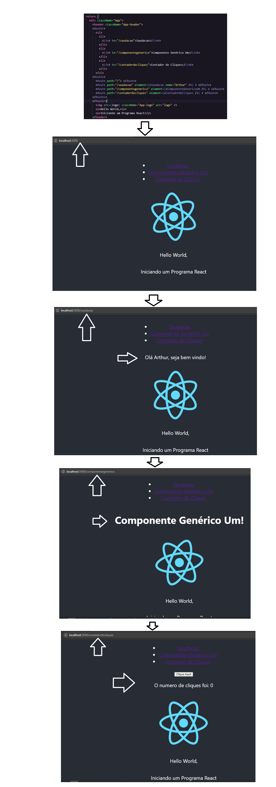

**Note: Estrutura base de um projeto React da atividade do curso Programação Acelerada da Softex - Pernambuco. Neste projeto será feita as atividades do modulo "React"**
##
> Atividade1: 

**Desenvolva e rode um programa React. Trabalhe esse código em seu IDE, suba ele para sua conta no GitHub e compartilhe o link desse projeto no campo ao lado para que outros desenvolvedores possam analisá-lo.**
##
> Atividade 2:

**A atividade2 foi feita em outro projeto, nomeado de "atv2-softex", link: https://github.com/ArthurLuizS/SoftexRecife/tree/main/Modulo_React/atv2-softex**
##

> Atividade 3: 

**No projeto base, criado no Peer Tutoring 1, crie um componente principal e um componente react.O Componente principal é o "App.js" o componente react criado está na pasta "src>Components" com o nome "ComponenteGenericoUm"**

##

> Atividade 4:

**No projeto base, criado no Peer Tutoring 1,utilize props em um componente react.**

##
> Atividade 5:

**No projeto base react, criado no Peer Tutoring 1, crie um botão que aumente o valor de uma propriedade de um componente react usando hooks.**

##

> Atividade 6:

**No projeto base react, criado no Peer Tutoring 1, crie um componente com roteamento entre as telas.**

# Getting Started with Create React App

This project was bootstrapped with [Create React App](https://github.com/facebook/create-react-app).

## Available Scripts

In the project directory, you can run:

### `npm start`

Runs the app in the development mode.\
Open [http://localhost:3000](http://localhost:3000) to view it in your browser.

The page will reload when you make changes.\
You may also see any lint errors in the console.

