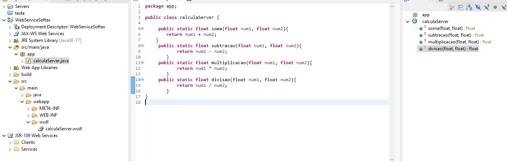
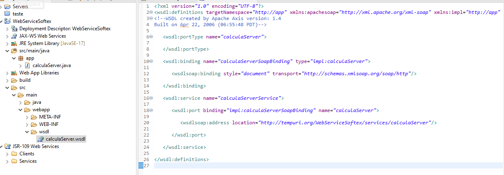
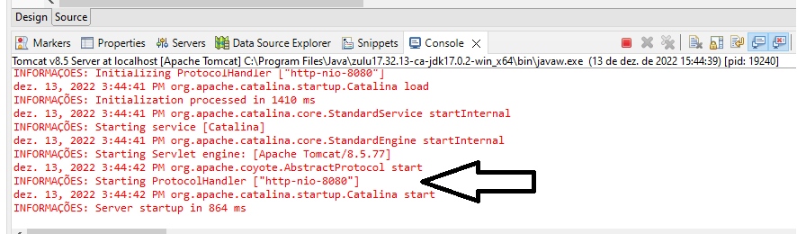

> Atividade 3

**Crie um servidor SOAP simples usando Java, disponibilize endpoints (métodos) e crie, no mínimo, quatro deles. Por fim, coloque para rodar na porta 8080.**

- Classe do Serviço: 

- Arquivo WSDL

- Servidor rodando na porta 8080

