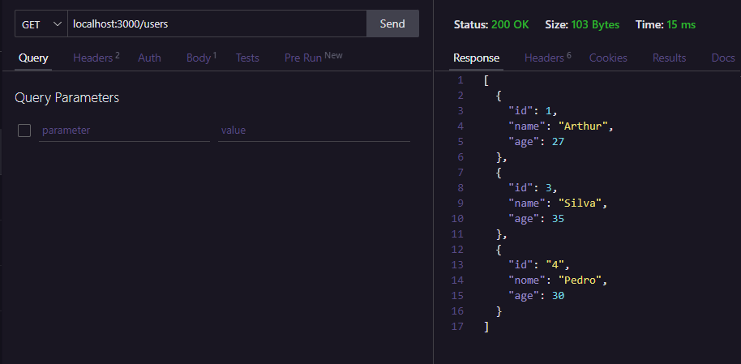

> Atividade: 

**Faça um código para implementar o CRUD de algum recurso. Por exemplo: alunos, equipamentos ou vendas. Aponte as rotas e os retornos do status HTTP.**

##

**CRUD utilizando express, para simular um simples cadastro de usuarios, com métodos:**
> GET, POST, PUT e DELETE

##

Rotas:

> GET | localhost:3000/users

## 
> POST | localhost:3000/users

##

> PUT | localhost:3000/users/

O número 4 ao final da url, indica qual o id do usuário que será atualizado

##

> DELETE | localhost:3000/users/2

O número 2 ao final da url, indica qual o id do usuário que será deletado

##

> GET nos dados finais  **GET | localhost:3000/users**

##